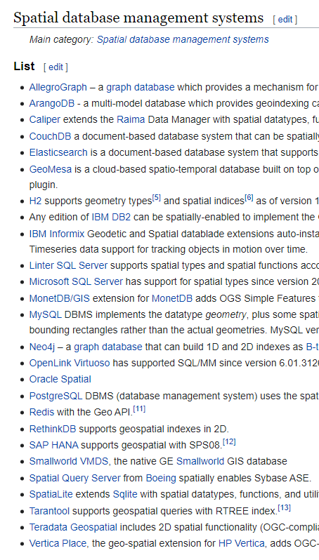
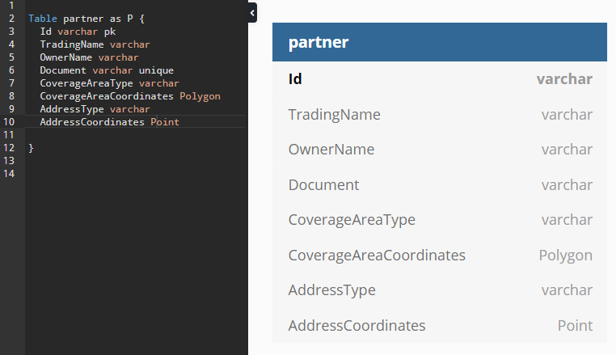

# Ze Delivery Backend Challenge

# Architectural decisions


# The database
Como o challenge é um problema de geolocalização, seguindo o padrão GeoJson, procurei uma lista de bancos que lidam com esse tipo de dados [Spatial_database](https://en.wikipedia.org/wiki/Spatial_database) 

"A spatial database is a database optimized for storing and querying data that represents objects defined in a geometric space." - [Wikipedia](https://en.wikipedia.org/wiki/Spatial_database)

Contendo uma lista de bancos: 



Decidi então utilizar o MySql, pois ele já contém suporte nativo para o tipo de dados `geometry` seguindo o padrão [`OpenGIS`](https://web.archive.org/web/20130430004440/http://dev.mysql.com/doc/refman/5.5/en/gis-introduction.html)

Escolhi utilizar esse esquema de dados, utilizando a seguinte estrutura e os tipos [`Polygon` e `Point`](https://dev.mysql.com/doc/refman/5.7/en/gis-polygon-property-functions.html):



Representando em [DDL](scripts/01_CREATE_DATABASE_SCRIPT.sql) para o MySql, a tabela ficou da seguinte forma:
```
CREATE TABLE `partner` (
  `Id` varchar(255) PRIMARY KEY,
  `TradingName` varchar(255),
  `OwnerName` varchar(255),
  `Document` varchar(18) UNIQUE,
  `CoverageAreaType` varchar(255),
  `CoverageAreaCoordinates` POLYGON,
  `AddressType` varchar(255),
  `AddressCoordinates` POINT
);
```

Para realiza as queries, decidi utilizar o framework [Dapper](https://dapper-tutorial.net).


# Application Architecture

# Caching

# Resilience

# Deploy

