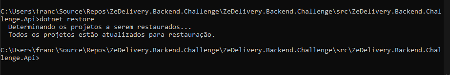

# Ze Delivery Backend Challenge

Repositório referente ao desafio de backend da Zé Delivery. O desafio pode ser encontrado aqui: https://github.com/ZXVentures/ze-code-challenges/blob/master/backend.md

  Foram escolhidas as tecnologias C# .NET e MySQL.


# Decisões arquiteturais

  Para o pilar de *Performance*, as buscas necessitam ser rápidas, é fundamental realizar tais buscas no banco e utilizando o [Redis](https://redis.io) como ferramenta de Caching para não bater no banco toda hora, utilizando [MsgPack](https://msgpack.org) para serializar os dados de forma mais otimizada.

  Para o pilar *Testability*, decidi testar o código de forma unitária utilizando a biblioteca [NUnit](https://nunit.org) e [NSubstitute](https://nsubstitute.github.io).

  Para o pilar *Maintainability* e *Separation of concerns* decidi estruturar a arquitetura do código seguindo o padrão arquitetural [Clean Architecture](https://blog.cleancoder.com/uncle-bob/2012/08/13/the-clean-architecture.html) seguindo bem o desenho abaixo: 
  
  Facilitando na reutilização e extensão de componentes, e também o desacoplamento de casos de uso.
  O projeto ficou separado entre as camadas de `Api`, `Application`, `Domain` e `Infrastructure`. Cada camada tendo sua responsabilidade, evitando que tecnologias impactem no core do negócio (domínio).

# Banco de dados

Como o challenge é um problema de geolocalização, seguindo o padrão GeoJson, procurei uma lista de bancos que lidam com esse tipo de dados [Spatial database](https://en.wikipedia.org/wiki/Spatial_database) 

"A spatial database is a database optimized for storing and querying data that represents objects defined in a geometric space." - [Wikipedia](https://en.wikipedia.org/wiki/Spatial_database)

Contendo a lista de bancos: 


Decidi então utilizar o MySql, pois ele já contém suporte nativo para o tipo de dados `geometry` seguindo o padrão [`OpenGIS`](https://web.archive.org/web/20130430004440/http://dev.mysql.com/doc/refman/5.5/en/gis-introduction.html)

Escolhi utilizar esse esquema de dados, utilizando a seguinte estrutura e os tipos [`Polygon` e `Point`](https://dev.mysql.com/doc/refman/5.7/en/gis-polygon-property-functions.html):


Representando em [DDL](scripts/01_CREATE_DATABASE_SCRIPT.sql) para o MySql, a tabela ficou da seguinte forma:
```
CREATE TABLE `partner` (
  `Id` varchar(255) PRIMARY KEY,
  `TradingName` varchar(255),
  `OwnerName` varchar(255),
  `Document` varchar(18) UNIQUE,
  `CoverageAreaType` varchar(255),
  `CoverageAreaCoordinates` POLYGON,
  `AddressType` varchar(255),
  `AddressCoordinates` POINT
);
```

Para realiza as queries de forma mais otimizada, decidi utilizar o framework [Dapper](https://dapper-tutorial.net).

E para realizar as buscas geométricas, utilizei as funções: [`st_contains` e `st_distance_sphere`](https://dev.mysql.com/doc/refman/5.6/en/spatial-relation-functions-object-shapes.html)

# Caching

  Decidi utilizar o Redis como caching, para evitar idas repetidas no banco de dados. Utilizei nos casos de uso: `SearchNearestPartner` e `FindPartner`.
  Para facilitar a utilização do caching, construi o serviço genérico que armazena qualquer objeto:


Para a serialização de dados, decidi utilizar o [MsgPack](https://msgpack.org)


[Para comparação com outros serializadores](https://medium.com/@maximn/serialization-performance-comparison-xml-binary-json-p-ad737545d227):


# Testes
 Implementei alguns cenários de testes para dois dos três casos de uso: 
 `CreatePartner` e `FindPartner`.

 Tentei utilizar o padrão BDD com Specflow, porém tive alguns problemas para rodar. Decidi então migrar o código baseado em comportamento para um código unitário clássico. Pode ver exemplo de um cenário abaixo:


Dessa forma, cobri alguns fluxos e deixei outros sem implementação para evidenciar a facilidade de escrever novos testes unitários.


Fluxos cobertos:


# Cross Plataform

Para cumprir com o requisito de ser cross plataform, decidi utilizar o Docker e DockerCompose para subir a aplicação e os serviços necessários (Caching e Banco de dados). Bastando apenas executar o comando em ambientes Windows/Linux:
```
docker-compose up -d
```

 # Como rodar a aplicação:
  
  - É necessário instalar a SDK .NET 5.0:
```
  https://dotnet.microsoft.com/download
```

  Após instalar, rodar os comandos:

- Entrar na pasta da Api de inicialização do projeto:

```
cd src\ZeDelivery.Backend.Challenge.Api
```


- Restaurar os pacotes Nuget:
```
dotnet restore
```


- Buildar a aplicação:
```
dotnet build
```


  - Para subir os serviços de Banco e Redis é necessário rodar o docker compose dentro do diretório do projeto. Retornar duas pastas: 
```
cd ..;
cd ..;
docker-compose up -d;
```


- Verificar que os serviços estão rodando:

```
docker ps;
```


- É necessário criar o banco de dados e a tabela. Infelizmente não consegui incluir o script de criação do banco na subida do docker-compose. Para criar o banco, abrir Adminer no endereço: 
```
http://localhost:8080
```

Com os seguintes dados de login:
```
Servidor: mysqlsrv
Usuário: root
Senha: MySql2019!
```


- Rodar o script da pasta: `scripts/01_CREATE_DATABASE_SCRIPT.sql`:
```
CREATE DATABASE IF NOT EXISTS ZeDeliveryBackendChallenge;
USE ZeDeliveryBackendChallenge;
CREATE TABLE `partner` (
  `Id` varchar(255) PRIMARY KEY,
  `TradingName` varchar(255),
  `OwnerName` varchar(255),
  `Document` varchar(18) UNIQUE,
  `CoverageAreaType` varchar(255),
  `CoverageAreaCoordinates` POLYGON,
  `AddressType` varchar(255),
  `AddressCoordinates` POINT
);

```


Criando assim, a tabela necessária para a aplicação rodar.


- Por último, para rodar a aplicação:

- - Entrar na pasta da Api de inicialização do projeto:

```
cd src\ZeDelivery.Backend.Challenge.Api
```


 - - Rodar a aplicação: 
```
dotnet run
```


- Acessar o swagger da aplicação:

```
https://localhost:5001/swagger/index.html
```


# Rodando os casos de uso 
Para o exemplo abaixo, Utilizei o partner do arquivo: `data/single_test.json`

- Inserir novo partner:


- Buscar partner por Id:


- Buscar partnet mais proximo:


# Melhorias futuras:

  Infelizmente não consegui fazer o cointainer da aplicação rodar em conjunto com os outros serviços no docker compose. Está ocorrendo erro de conexão. Dificultando a instalação.

  Também ficou faltando subir o banco já com seu script de criação, para não necessitar criar o banco e a tabela na mão.
